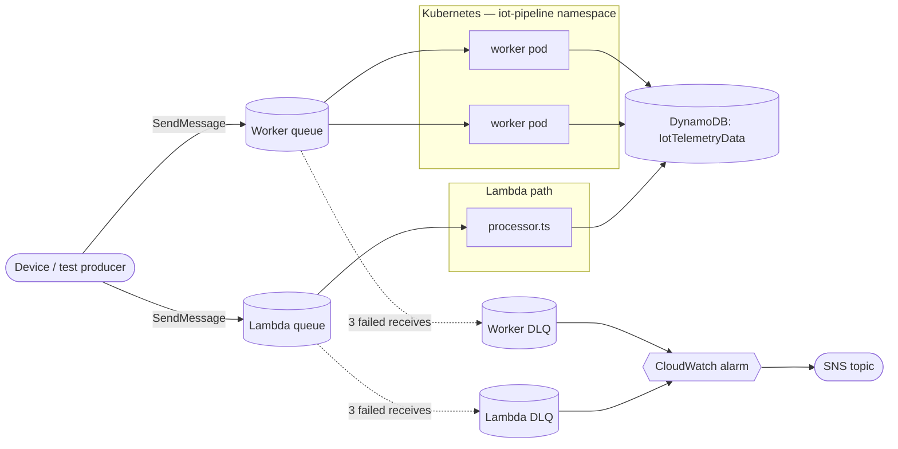

# aws-iot

IoT telemetry pipeline, built two ways on purpose: Lambda + SQS, and a containerized worker on
Kubernetes. Same DynamoDB table underneath either way, so the two can be compared side by side
instead of picking one.

## Architecture



Two queues, two DLQs, one table. Each row's `processedBy` field says which path wrote it
(`iot-lambda-processor` or `iot-sqs-worker`), so both can run at the same time without stepping
on each other — they just never share a queue.

## Deploying the infrastructure

Needs an AWS account. CDK is already a project dependency, so `npx` picks it up.

```
npm install
npx cdk bootstrap                    # one-time per account/region
npx cdk deploy --context stage=dev
```

Grab `WorkerQueueUrlOutput` from the deploy output — you'll need it below. `stage` defaults to
`dev`; pass `staging` or `prod` to run an independently-named copy of the stack in the same
account.

## Running the worker

CDK doesn't deploy the worker itself — running it as a container is the point.

Config is environment variables, validated in `src/config.ts`:

| Variable | Example | Notes |
|---|---|---|
| `AWS_REGION` | `eu-west-1` | |
| `QUEUE_URL` | from `WorkerQueueUrlOutput` | the worker queue, not the Lambda one |
| `TABLE_NAME` | `IotTelemetryData-dev` | |
| `PORT` | `3000` | health check server |
| `VISIBILITY_TIMEOUT_SECONDS` | `60` | optional |
| `MAX_MESSAGES` | `10` | optional |

Directly, no build step:
```
npm run dev
```

Docker:
```
docker build -t iot-worker:dev .
docker run --env-file .env --env-file .env.aws-credentials -p 3000:3000 iot-worker:dev
```

Kubernetes (manifests in `k8s/`; written and tested against Docker Desktop's local cluster):
```
kubectl apply -f k8s/
```
Brings up the namespace, ConfigMap, a Deployment (2 replicas, resource limits, liveness/readiness
probes on `/health`), a Service, a PodDisruptionBudget, and a NetworkPolicy restricting egress to
DNS + HTTPS. AWS credentials go in a Secret — `k8s/02-secret.example.yaml` shows the shape, but
create the real one with `kubectl create secret ... --from-env-file=.env.aws-credentials` instead
of ever committing actual keys.

Scaling is manual for now — `kubectl scale deployment/iot-worker -n iot-pipeline --replicas=N`.
No HPA/KEDA wired up yet.

## Sending a test message

```
aws sqs send-message --queue-url <queue-url> --message-body '{
  "eventId": "evt-1",
  "deviceId": "device-1",
  "timestamp": "2026-09-12T00:00:00.000Z",
  "telemetry": { "temperature": 21.5, "humidity": 40, "batteryLevel": 87, "status": "ok" }
}'
```

## Not done yet

No CI, no real test coverage beyond a stub, no autoscaling, no observability past CloudWatch logs
and the alarms CDK sets up. Working through it incrementally.
